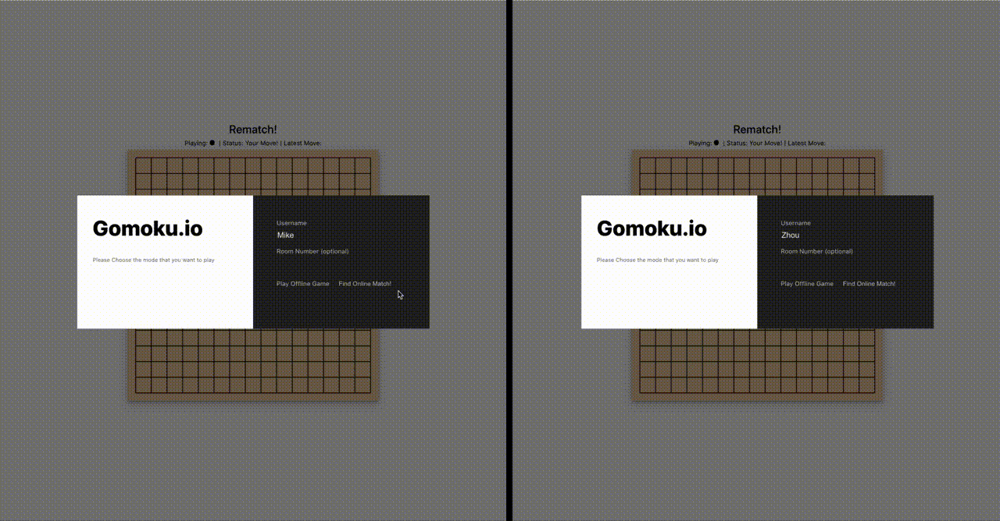

# Introduction
This is a real-time PVP online Gomoku matchmaking website. 

Frontend: React.js

Backend Node.js with socket.io

Functions
* Build in chatroom to enable trash talk
* Able to create room and enter specified room
* Mobile responsive

# Demo



# Build

To start server
```
yarn install
yarn start
```
To build client
```
cd client && yarn install
yarn start
```
